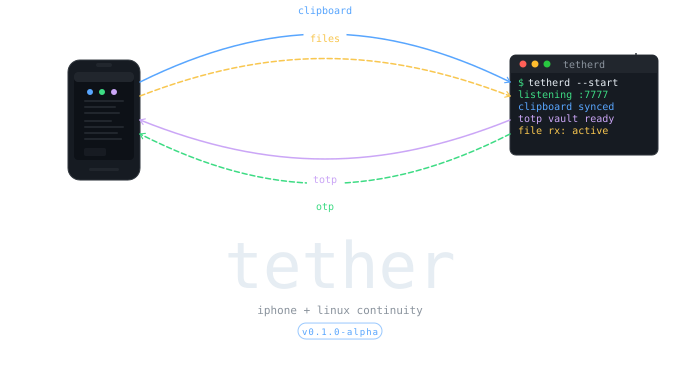

# Tether

**Tether** is an open-source companion device integration suite designed to bridge the gap between iOS (iPhone/iPad) and the Linux Wayland desktop universe.

If you have migrated away from macOS but still carry an iPhone, Tether provides the missing ecosystem integration, acting as your self-hosted equivalent to Apple's Continuity and Universal Clipboard.

## Scope & Features

* **Clipboard Sync:** Seamlessly shares your Wayland compositor (`wlr-data-control`) clipboard over the Tether network so copied text propagates instantly to the iPhone app, and vice-versa.
* **File Transfer:** Drag and drop files from Linux directly into the iPhone app natively, or Vice Versa automatically deposited to your `$XDG_DOWNLOAD_DIR`.
* **Device Pairing:** Securely pair devices using **Mutually Authenticated TLS (mTLS)**, restricting TCP traffic securely using X.509 RSA Certificates dynamically.
* **TOTP/OTP Vault (WIP):** Encrypted TOTP secret management synced across your daemon and phone, with Safari autofill via `ASCredentialProviderExtension` on iOS, and Wayland browser autofill via a WebExtension.

## Architecture

Tether operates using a tri-component architecture:

1. **`tetherd` (The Linux Daemon):** A background C++ process built on top of `epoll` and Wayland protocols via `hyprwayland-scanner`. It anchors the Linux clipboard and broadcasts events over UNIX Domain Sockets (`$XDG_RUNTIME_DIR/tether/tetherd.sock`). Network traffic securely traverses local TCP via OpenSSL.
2. **`tether` (The CLI):** A lightweight C++ cli program to communicate natively with the daemon. Also features built-in TLS wrapping for testing the network stack via `--host`.
3. **iPhone App (WIP):** A native SwiftUI iOS 16+ app discovering the daemon via Bonjour/mDNS, utilizing Apple's `Network.framework` to securely negotiate TLS.
4. **Browser Extension (WIP):** A WebExtension that interfaces with the daemon via native messaging.

## Building `tetherd`

Tether uses standard modern CMake (C++20). 

**Dependencies:**
- `wayland-client`
- `openssl`
- `pkg_config`
- `ninja`

To compile:
```bash
# Formats code, configures CMake via presets, and builds with Ninja
make debug

# Run the daemon
make run-daemon
```

*Note: The daemon utilizes an advisory lock (`$XDG_RUNTIME_DIR/tether/tetherd.lock`) ensuring only one instance controls the Wayland connection at a time.*

## License

Tether is licensed under the [MIT License](LICENSE).
