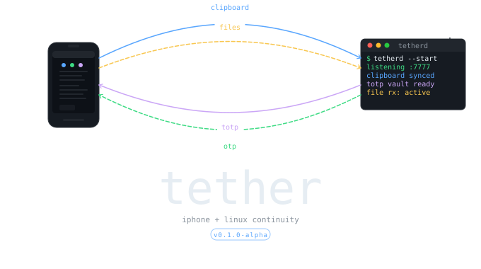

# Tether

> Bridge your iPhone to the Linux Wayland desktop

**Tether** aims to support all of the [Apple Continuity](https://www.apple.com/macos/continuity/) features on Linux that are technically possible. If you've migrated away from macOS but still carry an iPhone, Tether provides the missing ecosystem integration.

[](LICENSE)

[](https://addons.mozilla.org/en-US/firefox/addon/tether-browser-extension/)

[](https://addons.thunderbird.net/en-US/thunderbird/addon/tether-mail-extension/)

[](https://apps.apple.com/us/app/tether-linux-companion/id6762097135)

[](https://github.com/zackb/tether/actions/workflows/arch.yml)
[](https://github.com/zackb/tether/actions/workflows/fedora.yml)
[](https://github.com/zackb/tether/actions/workflows/debian.yml)
[](https://github.com/zackb/tether/actions/workflows/ubuntu.yml)


## Features

| Feature | Status |
|---------|--------|
| **Clipboard Sync** | ✅ Stable |
| **File Transfer** | ✅ Stable |
| **iOS App** | ✅ Stable |
| **Browser Extension** | ✅ Stable |
| **Mail Extension** | ✅ Stable |
| **Messages (SMS/iMessage)** | ✅ Stable |
| **Notification Mirroring** | 🧪 Beta |
| **Phone Calls** (PipeWire only) | 🧪 Alpha |
| **AirPods** (opt-in) | 🧪 Alpha |

### Clipboard Sync
Text copied on your Linux desktop appears instantly on your iPhone, and vice versa.

### File Transfer
Drag and drop files from Linux directly into the iPhone app, or receive files automatically to your `$XDG_DOWNLOAD_DIR` (~/Downloads).

### Messages and Notifications
Read and reply to SMS and iMessage conversations, and see notifications from any app on the phone, on the Linux desktop.

### Device Pairing
There are two ways tether communicates with the iPhone:
- WiFi: for clipboard sync, file transfer, and OTP handling
- Bluetooth: for Messages, Notifications, and Calls

You can use either or both, depending on your needs.

Connections run over TLS 1.2 and both sides present a self-signed X.509 certificate.

### Phone Calls
Place, answer and end calls on the iPhone from the desktop, complete with caller ID and the phone's carrier and signal. 
The call audio stays on the iPhone. If you've used Linux long enough you know why (it sounds like "FalsePotty-o"). PulsAlsaWire is too hard to support across all deployment targets.

### OTP Handling
Streamline two-factor authentication across your devices:
- iOS Share Extension: Send OTP codes from your iPhone to your Linux clipboard.
- Thunderbird Addon: Automatically parse OTP codes from incoming email messages.
- Browser Extension: Autofill OTP codes into login forms from the iOS app or the mail extension.
- SMS / iMessage: Detects OTP codes in incoming messages and notifications and offers them to the browser extension for autofill.

### Browser & Mail Extensions
A unified WebExtension that works in Thunderbird/Betterbird and Firefox/Chromium browsers:

- **Thunderbird/Betterbird:** Detects OTP codes in incoming emails (verification codes, 2FA messages) and copies them to the clipboard or sends them to the Tether daemon for vault storage
- **Firefox/Chromium:** Autofills OTP codes into login forms by retrieving secrets from the Tether vault, with one-click verification for sites using TOTP-based 2FA

The extension communicates with `tetherd` via native messaging. This allows users to autofill OTP codes into websites when the email arrives. 

## Installation

### iOS App
- Get the app: [Tether - Linux Companion](https://apps.apple.com/us/app/tether-linux-companion/id6762097135)

### Browser Extension
- Firefox: [Tether Browser Extension](https://addons.mozilla.org/en-US/firefox/addon/tether-browser-extension/)

### Mail Extension
- Thunderbird: [Tether Mail Extension](https://addons.thunderbird.net/en-US/thunderbird/addon/tether-mail-extension/)

### Arch Linux

```bash
yay -S tether
```

### AppImage

One file, no install, for distros without a package and for immutable systems.
Download `tether-<version>-<arch>.AppImage` from the
[releases page](https://github.com/zackb/tether/releases), then:

```bash
chmod +x tether-*.AppImage
./tether-*.AppImage                              # the GTK app
./tether-*.AppImage --bt-setup                   # the CLI, same binary
./tether-*.AppImage --install-extension-host     # if you use the browser or mail extension
```

The iPhone Bluetooth features need one-time system setup the AppImage cannot do for you.
`--bt-setup` prints the commands for this machine.

Requires glibc 2.38 and libstdc++ from GCC 13 (Fedora 39+, Ubuntu 23.10+, Debian 13+, Arch).

### Flatpak

Download `tether-<version>-<arch>.flatpak` from the
[releases page](https://github.com/zackb/tether/releases) if you're into that, then:

```bash
flatpak install ./tether-*.flatpak
flatpak run com.tether.desktop                                          # the GTK app
flatpak run --command=tether com.tether.desktop --bt-setup              # the CLI
flatpak run --command=tether com.tether.desktop --install-extension-host
```

Clipboard sync will most likely not work as it is a privileged protocol (`data-control`).
Use the AppImage instead if you want clipboard sync.

### Nix

#### Build from source

Enter the development shell and run the test suite:

```console
nix develop
make test
```

Build or run Tether directly from the flake:

```console
nix build
nix run
nix run .#tether -- --help
nix run .#tetherd
```

Bare `nix run` launches `tether-gtk`. The named app outputs are `tether` (CLI),
`tether-gtk` (GUI), `tetherd` (daemon), and `tether-dialog` (dialog helper).

#### Use the package in NixOS

After adding Tether as a flake input, install its package directly:

```nix
environment.systemPackages = [
  inputs.tether.packages.${pkgs.system}.default
];
```

Alternatively, apply the overlay and install `pkgs.tether`:

```nix
nixpkgs.overlays = [ inputs.tether.overlays.default ];
environment.systemPackages = [ pkgs.tether ];
```

#### Use the NixOS module

Import the module in your NixOS configuration:

```nix
imports = [ inputs.tether.nixosModules.default ];

programs.tether = {
  enable = true;

  wifi = {
    enable = true;
    openFirewall = true;
  };

  bluetooth = {
    enable = true;
    adapters = [ "hci0" ];
  };

  extensions = [
    "firefox"
    "chromium"
    "thunderbird"
  ];
};
```

Base enablement installs Tether and registers its native messaging hosts; it
does not start a daemon. Firewall opening is opt-in. Bluetooth experimental
mode and adapter class changes are also opt-in. If your system uses another
adapter or multiple adapters, change `bluetooth.adapters` accordingly.

### Build from Source

On Debian/Ubuntu:

```bash
sudo apt install build-essential cmake ninja-build pkg-config git \
    libwayland-dev libavahi-client-dev libssl-dev \
    libglib2.0-dev libgtk-3-dev libgtk-layer-shell-dev libnotify-dev \
    npm zip
```

On Fedora:

```bash
sudo dnf install gcc-c++ cmake ninja-build pkgconf-pkg-config git \
    wayland-devel avahi-devel openssl-devel \
    glib2-devel gtk3-devel gtk-layer-shell-devel libnotify-devel \
    npm zip
```

```bash
# Clone the repository
git clone https://github.com/zackb/tether.git
cd tether

# Build and test
make release

# Install the daemon, cli, and GTK app
make install
```

## Quick Start
1. On Linux, launch the GTK app (tether-gtk) or run the CLI to pair your iPhone.

2. WiFi pair via the GUI or CLI:

   Open the iOS app, it will auto-discover the daemon. You will be prompted on both the iPhone and Linux to accept the pairing request. Once accepted on both ends, the devices are paired.

   or

   ```bash
   tether pending               # the requests waiting, with their fingerprints
   tether accept <fingerprint>
   ```

3. Bluetooth (for Messages and Notifications):

   First, one-time system setup. This prints only the steps your machine still
   needs, with the exact commands:

   ```bash
   tether bt setup
   ```

   Tether never applies these itself: they change how the machine behaves over
   Bluetooth outside of Tether, so running them is your call. The same steps
   appear in the GTK app's Devices page, with a "Copy commands" button.

   *If* you have more than one Bluetooth controller, pick the one to use. Default is the first powered one.

   ```bash
   tether bt adapter hci1  # or the controller's address, or "auto"
   ```

   Then pair. In the GTK app, pick your iPhone under BLUETOOTH on the Devices
   page and press "Pair over Bluetooth". Confirm the code on both the iPhone and
   Linux.

   or

   ```bash
   tether bt devices         # find the iPhone's address
   tether bt pair <address>
   tether bt connection      # what is up, and what is not
   ```

4. On the iPhone, under Settings > Bluetooth > (i) for this computer, enable
   "Show Message Notifications" and "Sync Contacts". Both are needed. They can
   take a few minutes to appear; "Show iPhone Permissions" in the GTK app
   re-advertises so they show up again.


### No desktop on the machine?

The daemon does not need a Wayland session. Everything but clipboard sync works
over SSH, pairing included:

```bash
systemctl --user enable --now tetherd.service  # portable build? tether service first
tether pending                                 # the pairing requests waiting, with fingerprints
tether accept 9a4f21...
tether status                                  # devices, links, and recent transfers
```

See [docs/HEADLESS.md](docs/HEADLESS.md).


## Components

1. **`tetherd`**: A background process running on Linux manages Bluetooth, TCP+TLS with pinned device certificates, and Wayland integration.

2. **`tether`**: A CLI to communicate with the daemon. This also allows the WebExtension to interface with the daemon via native messaging.

3. **`tether-gtk`**: An application for Linux that provides a graphical interface to manage devices, send files, trigger clipboard sync, read and reply to iPhone messages, see mirrored notifications, and monitor connection status.

4. **iPhone App**: Discovers the daemon via Bonjour/mDNS, utilizing Apple's `Network.framework` for secure TLS negotiation. Not required for SMS/iMessage and notification mirroring, which use Bluetooth.

5. **Browser/Mail Extension**: WebExtension that interfaces with the daemon via native messaging. Use with Thunderbird/Betterbird and Firefox or Chromium-based browsers.

## Requirements

### Linux
- Wayland compositor with `wlr-data-control` protocol (Hyprland, Sway, [Fenriz](https://github.com/zackb/fenriz) etc.)
- Build tools: cmake, ninja, pkg-config
- x86_64 or aarch64 (Asahi, Raspberry Pi OS Trixie+). 32-bit ARM is not supported.

### Dependencies
- `wayland-client`
- `openssl`
- `pkg-config`
- `ninja`
- `gtk3` (for `tether-gtk`)
- `nlohmann-json`
- `glib2`
- `avahi`
- `bluez`, `bluez-utils`, and `bluez-obex` (for messages and notifications)

#### Bluetooth (for Messages and Notifications)
- BlueZ 5.86+ must be running with experimental bearer API. `tether bt setup`
  prints the command that enables it on this machine. Do this **before** pairing.
- A controller with BR/EDR, LE, and advertising support.
- Notification mirroring does not work on iOS 18 and earlier.

#### Network ports

WiFi features need two inbound ports on the Linux machine:

| Port | Why |
|------|-----|
| 5134/tcp | The `tetherd` mTLS listener the iPhone connects to |
| 5353/udp | mDNS service discovery `avahi-daemon` |

## Troubleshooting

### The iPhone finds this PC but never connects

Probably firewall. Most firewalls allow mDNS through, so discovery works, but then the iPhone can't get through on it's port (5134/tcp). Open the ports in your firewall.

```bash
sudo ufw allow Tether                                  # ufw
sudo firewall-cmd --permanent --add-service=tether     # firewalld
sudo firewall-cmd --reload
```

AppImage or the Flatpak, open the ports directly:

```bash
sudo ufw allow 5134/tcp && sudo ufw allow 5353/udp
sudo firewall-cmd --permanent --add-port=5134/tcp --add-port=5353/udp
sudo firewall-cmd --reload
```

On NixOS, set `programs.tether.wifi.openFirewall = true;` instead (see the [NixOS module](#use-the-nixos-module) above.

### The iPhone does not appear at all

`avahi-daemon` is not running, so nothing can discover this machine:

```bash
sudo systemctl enable --now avahi-daemon
```

### Bluetooth

Messages and notifications need one-time system setup. See [docs/BLUETOOTH.md](docs/BLUETOOTH.md), or run:

```bash
tether bt setup
```

## Security

Report security findings privately through
[GitHub Security Advisories](https://github.com/zackb/tether/security/advisories/new),
not a public issue. See [SECURITY.md](.github/SECURITY.md).

## Acknowledgements
* [ancs4linux](https://github.com/pzmarzly/ancs4linux) for pioneering the ANCS notifications technique.
* [iphonebridge](https://github.com/gabrielmeir53/iphonebridge) for the research on MAP Messages.
* [BlueFerry](https://github.com/erikwb/blueferry) for the [gold mine](https://github.com/erikwb/blueferry/blob/main/PROTOCOL.md).
* [@orychalk](https://github.com/orychalk) for many many feature ideas, bug reports, beta testing.


Contributions are welcome!

## License

Tether is licensed under the [MIT License](LICENSE).
